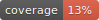

# epigraphhub_py

<div align="center">

[](https://github.com/thegraphnetwork/epigraphhub_py/actions?query=workflow%3Abuild)
[](https://pypi.org/project/epigraphhub_py/)

[](https://github.com/psf/black)
[](https://github.com/PyCQA/bandit)
[](https://github.com/thegraphnetwork/epigraphhub_py/blob/master/.pre-commit-config.yaml)
[](https://github.com/thegraphnetwork/epigraphhub_py/releases)
[](https://github.com/thegraphnetwork/epigraphhub_py/blob/master/LICENSE)


Epigraphhub Python package

</div>

The *EpiGraphHub library* is designed to provide external users with all of the analytical functionality used to power the [EpiGraphHub platform](https://epigraphhub.org/superset/welcome/) and its applications. In fact, all applications designed to run on the EpiGraphHub platform rely heavily on it.
This library should be used by users that want to contribute to the platform as well as by users that want to borrow some of the tools developed by our team in other opensource projects.
The EpiGraphHub library is also available for the [R](https://github.com/thegraphnetwork/r-epigraphhub/blob/main/epigraphhub.Rproj) language.

EpiGraphHub library allows users make and apply:

● Bayesian Statistics
● Epidemiological analysis
● Mathematical modelling
● Cost-effectiveness analysis
● Forecasting
● Machine Learning
● Text Mining
● Geo-Spatial analysis

## Installation

The EpigraphHub library can be installed using pip:

`$ pip install epigraphhub`

## Usage
View Example EpiGraphHub Applications in Our Documentation:

- [Downloading Google Trends Data (Python version)](https://epigraphhub-libraries.readthedocs.io/en/latest/data/trends.html#downloading-google-trends-data-python-version)
- [Fetching Raster data from WorldPop](https://epigraphhub-libraries.readthedocs.io/en/latest/data/worldpop.html)
- [Downloading data from World Bank Data](https://epigraphhub-libraries.readthedocs.io/en/latest/data/worldbank.html)
- [Epidemiological Data Analysis](https://epigraphhub-libraries.readthedocs.io/en/latest/analysis/index.html)

## Documentation

The official documentation is hosted on [ReadtheDocs](https://readthedocs.org/projects/epigraphhub-libraries/)

Check our [website](https://www.epigraphhub.org/) for most details about the EpiGraphHub project.

## How to contribute

If you want to contribute to EpiGraphHub, check our [Contributing Guide](https://github.com/thegraphnetwork/epigraphhub_py/blob/main/CONTRIBUTING.md).

## Code of conduct

Check our [Code of conduct](https://github.com/thegraphnetwork/epigraphhub_py/blob/main/CODE_OF_CONDUCT.md).

## 📈 Releases

You can see the list of available releases on the [GitHub Releases](https://github.com/thegraphnetwork/epigraphhub_py/releases) page.

We follow [Semantic Versions](https://semver.org/) specification.

We use [`Release Drafter`](https://github.com/marketplace/actions/release-drafter). As pull requests are merged, a draft release is kept up-to-date listing the changes, ready to publish when you’re ready. With the categories option, you can categorize pull requests in release notes using labels.

### List of labels and corresponding titles

|               **Label**               |  **Title in Releases**  |
| :-----------------------------------: | :---------------------: |
|       `enhancement`, `feature`        |       🚀 Features       |
| `bug`, `refactoring`, `bugfix`, `fix` | 🔧 Fixes & Refactoring  |
|       `build`, `ci`, `testing`        | 📦 Build System & CI/CD |
|              `breaking`               |   💥 Breaking Changes   |
|            `documentation`            |    📝 Documentation     |
|            `dependencies`             | ⬆️ Dependencies updates |

You can update it in [`release-drafter.yml`](https://github.com/thegraphnetwork/epigraphhub_py/blob/master/.github/release-drafter.yml).

GitHub creates the `bug`, `enhancement`, and `documentation` labels for you. Create the remaining labels on the Issues tab of your GitHub repository, when you need them.

## 🛡 License

[](https://github.com/thegraphnetwork/epigraphhub_py/blob/master/LICENSE)

This project is licensed under the terms of the `GNU GPL v3.0` license. See [LICENSE](https://github.com/thegraphnetwork/epigraphhub_py/blob/master/LICENSE) for more details.

## 📃 Citation

```bibtex
@misc{epigraphhub_py,
  author = {thegraphnetwork},
  title = {Epigraphhub Python package},
  year = {2021},
  publisher = {GitHub},
  journal = {GitHub repository},
  howpublished = {\url{https://github.com/thegraphnetwork/epigraphhub_py}}
}
```
