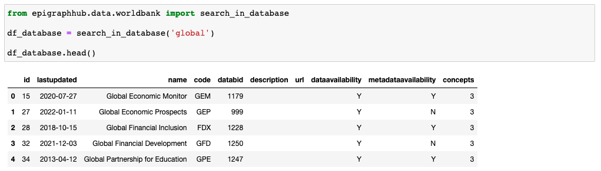
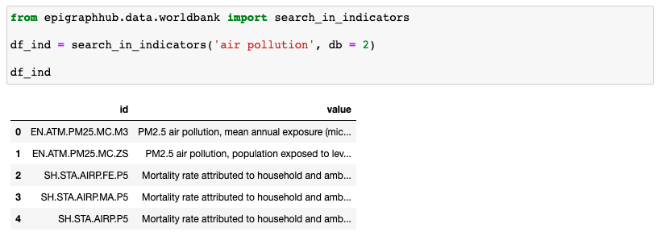
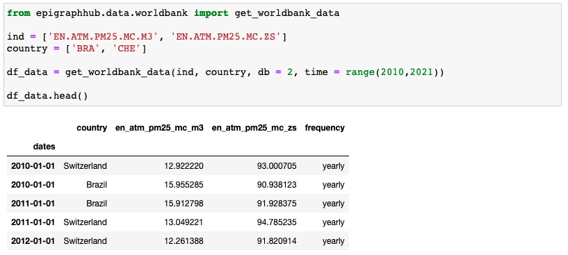
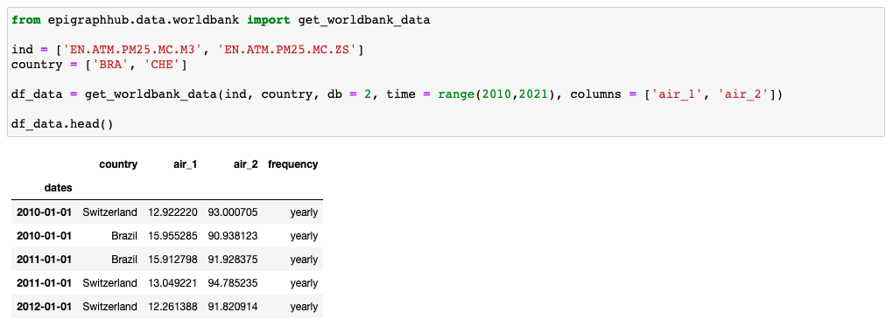
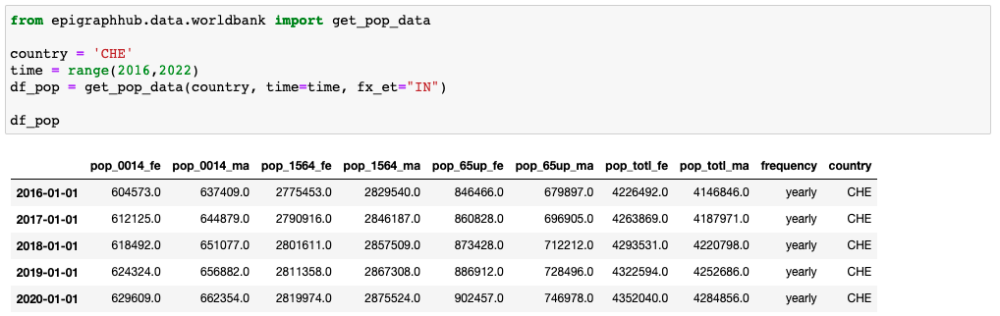

# Get the World Bank Data 

This section will explain how to use the functions in the `worldbank` module from the `epigraphhub` package to download the data hosted in the world data bank platform. 

All the functions created in this file were created based on the implementation of the package [**wbgapi**](https://pypi.org/project/wbgapi/). 

### Function `search_in_database()`

This function allows the user to search using a keyword the name of a database hosted in the world bank data. The function will search over all the databases hosted in the world bank data and return the matched values. The return of this function is a pandas data frame with some information about the databases found in the search. 
 
The most important columns of the data frame  returned are:

* The column `name`, that is used in the search to match with the keyword; 

* The column `id` that we will use to refer to the database in other functions;

* The column `lastupdated` that returns when was the last time that the data in the database was updated. 

This function has only one parameter. This parameter is named `keyword` and must be a string. 

For example, you can search over all the databases with the keyword `global` in the name. In this case, the return will be: 

If you use the `keyword = all` all the available databases will be returned.  

After selecting a database, we can use the function `search_in_indicators()` to see what indicators we can get from this database. 

### Function `search_in_indicators()`

This function accept two parameters. The first is `keyword`, which should be a string used to search combinations between the keyword and the indicator's name in a specific database. The second parameter is related with the database, it's called `db`. This parameter only accepts  **int** values as input. It must be filled with the **id** number of the database, which can be obtained with the function `search_in_database`. 

If the `db` parameter is not filled, the function assumes as default `db = 2`. In this configuration, the list of indicators from the database **World Development Indicators** is returned.

For example, to get the name of the indicators related to `air pollution` in the `db = 2`, just type `search_in_indicators('air pollution', db = 2)` and the returned data frame will be: 

We will use the `id` column values to get the data for the indicators described in the `value` cell associated with the `id` column. To get this data we will use the function `get_worldbank_data()`. 

### Function `get_worldbank_data()`

The function `get_worldbank_data` returns a data frame with indicators available in some database of the world bank data. 
 
 This function has the following parameters: 

 * `ind` : This parameter must be filled with a list of strings where each value in the list should be filled with an indicator's id value. An indicator's `id` value can be obtained with the function `search_in_indicators()`. 

 * `country`: This parameter must be filled with a list of strings where each value in the list should be filled with the ISO-CODE of each interest country. 

 * `db`: This parameter should be filled with an int value representing the database where the data is being captured. You can obtain this value with the function `search_in_database()`.

 * `time`: If filled ` time = 'all'`, the function will return all the data available. You can also specify a range of years. For example, if you want to get the data for the period between the years 2010 and 2020, you can fill this parameter with `time = range(2010,2021)`.

 * `columns`: This parameter will be used to rename the columns in the data frame returned. By default, the columns of the indicators will be named using the `ind` name. To rename the columns, you should provide a list of strings with the same length of the list int the parameter `ind`. Also, observe that the columns will be renamed respecting the order of the list. So, the first value in `columns` will be used as the new name of the first value in `ind`. 

For example, we can get the data for the two first indicators that we obtained in the last section for the countries Brazil and Switzerland. In this case `ind = ['EN.ATM.PM25.MC.M3', 'EN.ATM.PM25.MC.ZS']`, `country = ['BRA', 'CHE']`, `db = 2` (The indicators refered in `ind` are available in the dabatase refered by the number 2). To get the data between 2010 and 2020 we can use the parameter `time = range(2010,2021)`.

Using these parameters the result will be: 

 
By default, the function will transform all the upper cases in the column's name to lower case and replace '.' with '_'. If you would like to rename the columns with the names 'air_1' and 'air_2', for example,  just add the parameter `columns = ['air_1', 'air_2'] `, and the result will be: 

### Function `get_pop_data()`

This function gets the population data from the database with the id number equal to two. This database is called **World Development Indicators**. This function has three parameters: 

* `country`: It must be filled with a string with the ISO-CODE of the country which you want to get the data from. 

* `time`: If filled `time = 'all'`, the function will return all the data available. You can also specify a range of years. For example, if you want to get the data for the period between the years 2010 and 2020, you can fill this parameter with `time = range(2010,2021)`.

* `fx_et`: This parameter selects the stratification type in the population data. There are three different possibilities: 

- If `fx_et == '5Y'`, it will be returned the population by 5-year age groups.

- If `fx_et == 'IN'`, it will be return the population divided in 3 age groups.

- If `fx_et == 'TOTL'`, it will be returned the total population without considering the age groups.

The return of the function is a pandas data frame. 

In the image below, you can see an example of how to get the population data divided into three age groups in Switzerland. 

